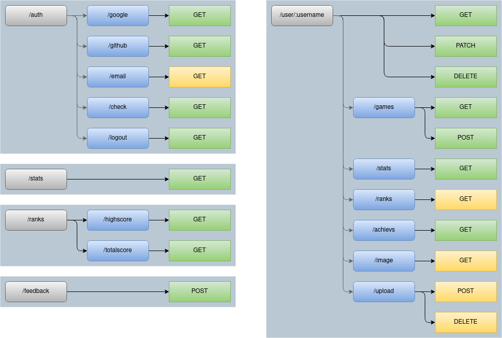

# trivia--backend

https://app.creately.com/diagram/NlH88ez9Ror/edit

# ENDPOINTS

## auth:

#### /auth/logout

	- GET

#### /auth/google

	- GET

#### /auth/github

	- GET

#### /auth/email

	- POST
		{email: String}

---

## user:

#### /user/:username

	- GET
		{
			message: String,
			payload:
				{
					username: String,
					email: String,
					dob: Date,
					nat: String,
					stats:
						{
							answers:
								{
									correct: Number,
									total: Number,
      					},
							score:
								{
									high: Number,
									total: Number,
      					},
							completedCategories:
								{
									max: Number,
									total: Number,
								},
							gamesPlayed: Number,
							categories: [], // under construction
						},
					achievs:
						{
							gamesPlayed: [Date],
							correctAnswers: [Date],
							highScore: [Date],
							totalScore: [Date],
							completedCategoriesMax: [Date],
							completedCategoriesTotal: [Date],
						},
					games:
						[{
							user: String,
							datePlayed: Date,
							score: Number,
							categories:
								[{
									name: String,
									answers: [Boolean],
								}],
						}],
				}
		}

	- PATCH
		{ // available options:
			username: String,
			email: String,
			dob: Date,
			nat: String,
			img: String,
			options:
				{
					joker: Boolean,
					timer: Boolean,
				},
		}

	- DELETE
		{
			message: String,
		}

#### /user/:username/games

	- GET
		{
			message: String,
			payload:
				[{
					user: String,
					datePlayed: Date,
					score: Number,
					categories:
						[{
							name: String,
							answers: [Boolean],
						}],
				}],
		}

	- POST
		{
			score: Number,
			categories:
				[{ // 6x
					name: String,
					answers: [Boolean], // 1-5x
				}],
		}

#### /user/:username/stats

	- GET
		{
  		message: String,
			payload:
				{
    			answers:
						{
      				correct: Number,
      				total: Number,
    				},
    			score:
						{
      				high: Number,
							total: Number,
						},
					completedCategories:
						{
							max: Number,
      				total: Number,
    				},
					gamesPlayed: Number,
					categories: [] // under construction
				}
		}

#### /user/:username/achievs

	- GET
		{
			message: String,
			payload:
				{
					gamesPlayed: [Date],
					correctAnswers: [Date],
					highScore: [Date],
					totalScore: [Date],
					completedCategoriesMax: [Date],
					completedCategoriesTotal: [Date],
				},
		}

#### /user/:username/upload

	- GET
		{
			message: String,
		}

	- POST
		{ // profile image
			userImg: pngFile
		}

---

## others:

### /stats

	- GET
		{
			message: String,
			payload:
				{
					gamesPlayed: Number,
					answers:
						{
							total: Number,
							correct: Number,
						},
					score:
						{
							total: Number,
							high: Number,
						},
					completedCategories,
			},
		}

### /ranks/highscore

	- GET
		{
			message: String,
			payload:
				[{
					username: String,
					value: Number,
				}],
		}

### /ranks/highscore

	- GET
		{
			message: String,
			payload:
				[{
					username: String,
					value: Number,
				}],
		}

### /feedback

	- POST
		{
			value: Number, // 1-5
			message: String,
		}
